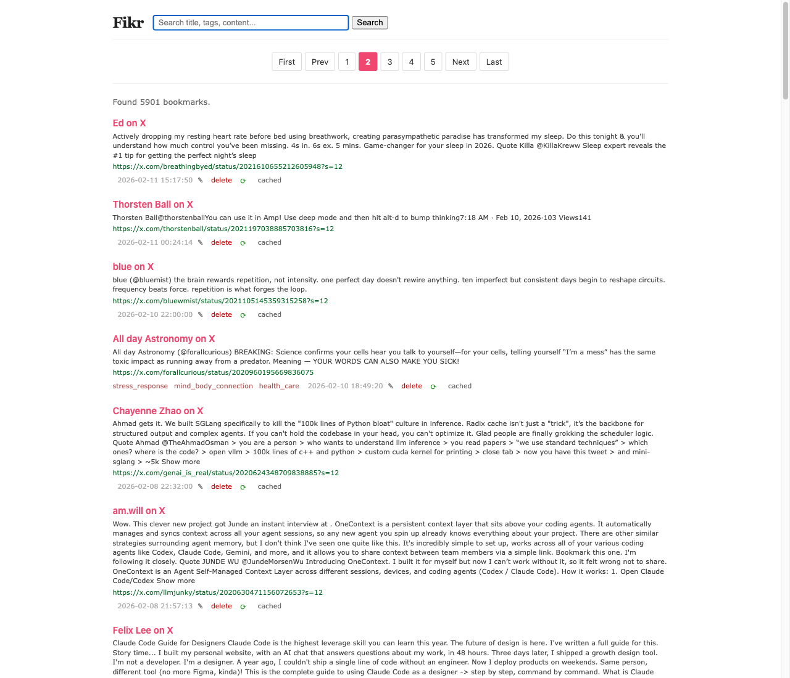
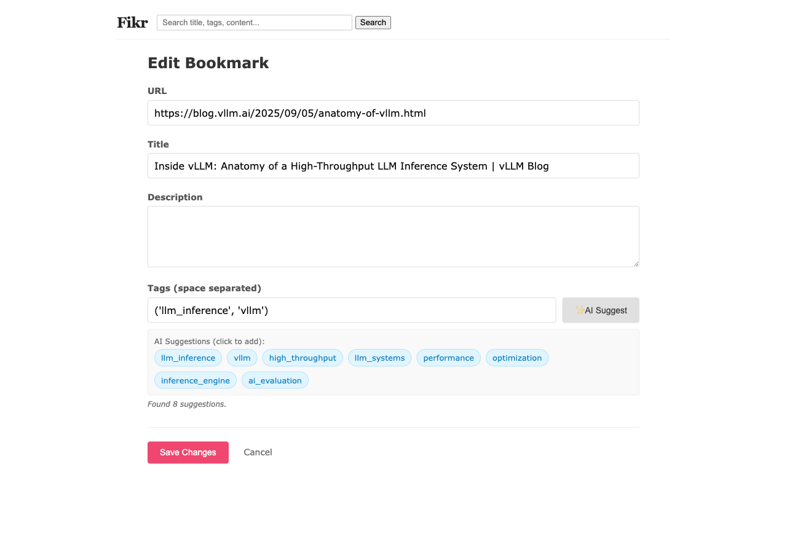
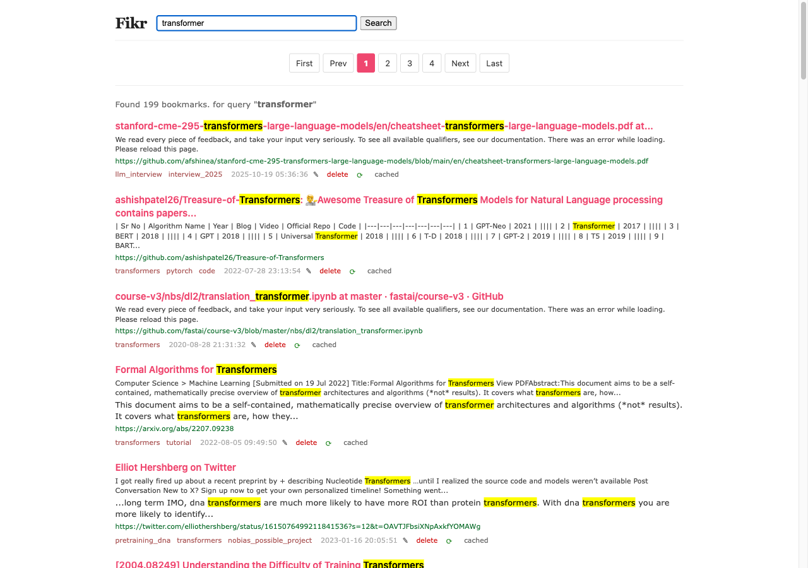
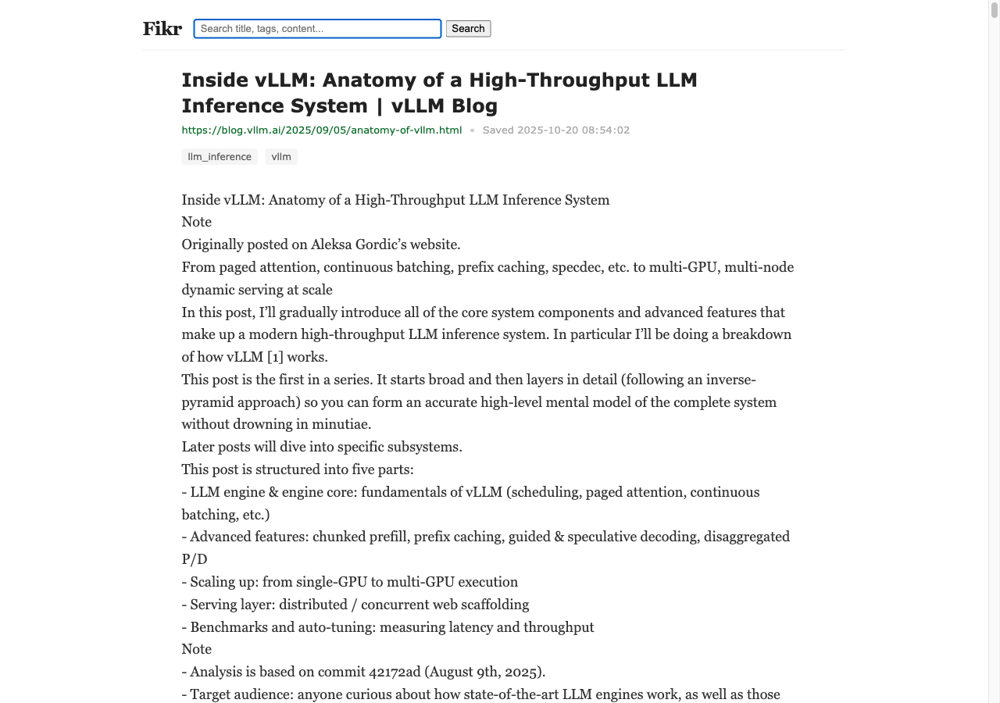
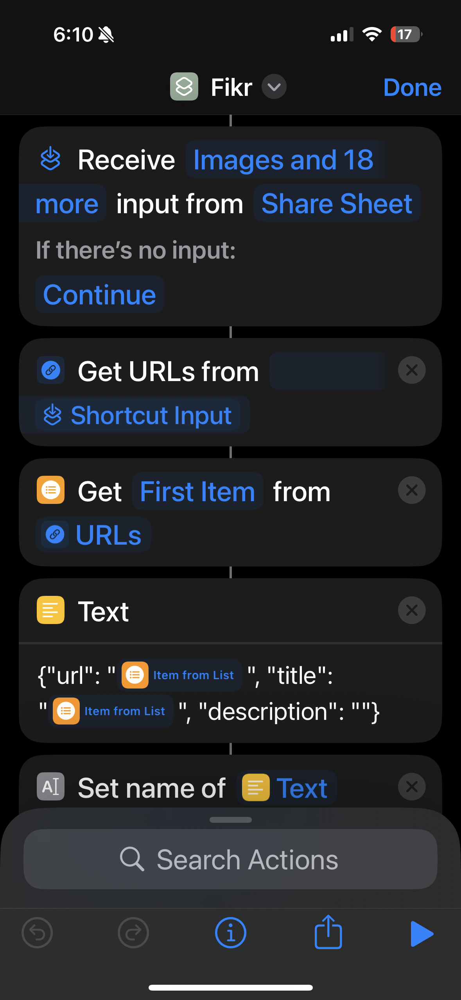
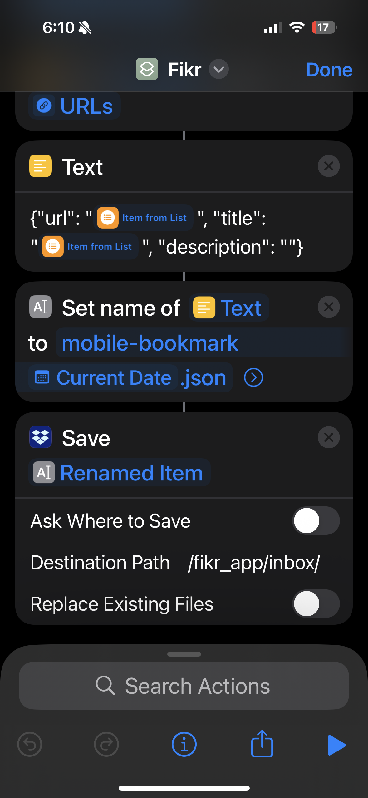

# Fikr

A self-hosted, AI-augmented bookmark manager. A personal Pinboard replacement, syncs across iPhone and browser, and quietly does the boring work of tagging and archiving in the background.

Built end-to-end — backend, web UI, iOS app + share extension, Chrome extension, and an iOS-Shortcut → Dropbox ingestion path. Roughly 8,000 lines of python code.

---

## Screenshots

**Web UI — list view, filtered by tag**


**Gemini-powered tag suggestion in the edit view**


**Full-text search with FTS5 BM25 ranking and snippet highlighting**


**Bookmark detail view with archived article text**


**iOS Shortcut workflow — capture from any app's share sheet, drop JSON into Dropbox, get picked up by the inbox worker**

<p align="center">
  
  
</p>

---

## Why this repo exists

I have ~5k bookmarks. Pinboard was the right tool for four years; But its developer has abandoned it. It also fails to capture content of X bookmarks which are a bulk of my bookmarks. So I built one for myself with all the features I always wanted.

Two artifacts in this repo are the methodology, not the code:

- [`AGENTS.md`](AGENTS.md) — a 21KB spec I hand to coding agents at the start of every session. It defines the architecture rules (Actions / Calculations / Data separation, functional core / imperative shell), the test discipline (BDD scenarios + unit tests for pure functions, contract tests at adapter boundaries), the refactoring patterns the agent is allowed to apply, and explicit "agent decision checklists" for ambiguous calls. The point is to give an LLM enough scaffolding that its output stays structurally consistent across sessions and across modules.
- [`PLAN.md`](PLAN.md) and [`docs/IOS_APP_PLAN.md`](docs/IOS_APP_PLAN.md) — the planning artifacts produced *with* the agent before any code was written. Architecture decisions, tradeoffs, the specific data-rescue path off Pinboard. They're committed because they're part of the workflow, not afterthought docs.

---

## Engineering highlights

- **SQLite FTS5 with BM25 ranking.** Virtual table over title / description / tags / archived content, `unicode61` tokenizer with diacritics removed, prefix-wildcard support, `snippet()` for the `<mark>` highlights you see in the search screenshot above. INSERT / UPDATE / DELETE triggers keep the FTS index in sync with the canonical `bookmarks` table.
- **Multi-stage archiving pipeline.** Each new bookmark hits a worker that tries [trafilatura](https://github.com/adbar/trafilatura) first; falls back to a headless **Playwright** render for JS-heavy SPAs (X.com, YouTube, Instagram); and for tweets where the DOM is hostile, takes a screenshot and runs **Gemini Vision OCR** to extract the post text. This is what survives the constant churn in X's frontend.
- **Daemon-thread workers.** Two background loops attached at FastAPI startup: an `inbox_worker` polling `inbox/` every 5 s for JSON dropped by the iOS Shortcut, and an `archiver_worker` that batches 5 unarchived bookmarks per minute. No queues, no Celery — for a single-user system, threads + polling is the right call.
- **Functional core, imperative shell.** `src/logic.py` is pure (no I/O imports, frozen dataclasses, deterministic). `src/db.py` is the SQLite adapter. `src/main.py` orchestrates. DTOs at the API boundary (`src/dtos.py`). Architecture rules are codified in `AGENTS.md` rather than enforced by linting — they're the agent's guardrails.
- **AI tagging that respects existing taxonomy.** `POST /api/suggest-tags` pulls the user's full tag vocabulary, hands it to Gemini under JSON-mode constraints, and asks for *consistent* tags rather than novel ones. Stops the long-tail synonym sprawl that AI tagging usually causes.
- **Multi-platform capture, one storage backend.** Web form, Chrome extension popup (Alt-B), iOS native app with share extension, and iOS Shortcut → Dropbox → inbox worker. All four converge on the same SQLite file.

---

## Architecture

```
                   iOS Share Sheet
                         │
                  iOS Shortcut (JSON)
                         │
                    Dropbox sync
                         │
                         ▼
   ┌──────────┐   ┌────────────┐
   │ inbox/   │──▶│ inbox_     │──┐
   └──────────┘   │ worker     │  │
                  └────────────┘  │
                                  │
   Chrome ext  ──┐                ▼
   iOS app     ──┴─▶ FastAPI ──▶ SQLite ◀── FTS5 index
   Web UI      ──┘     │            ▲
                       │            │
                       ├──▶ Gemini  │
                       │   (tags +  │
                       │    OCR)    │
                       │            │
                       └──▶ archiver_worker
                              │
                              ├─▶ trafilatura
                              ├─▶ Playwright
                              └─▶ Gemini Vision (tweet OCR)
```

---

## Tech stack

- **Backend** — Python 3.10+, FastAPI, SQLite (FTS5), Jinja2 templates, vanilla CSS
- **Archiving** — trafilatura, Playwright, Google GenAI SDK (Gemini)
- **iOS** — Swift / SwiftUI, share extension, Tailscale for LAN-less reachability
- **Browser** — Manifest V3 Chrome / Brave extension
- **Dev** — `uv` for env / deps, `make` for entrypoints

---

## Setup

Requires Python 3.10+ and [uv](https://github.com/astral-sh/uv).

```bash
git clone https://github.com/<your-username>/fikr.git
cd fikr

uv sync

cp .env.example .env
# edit .env and paste your GEMINI_API_KEY

uv run python -m src.init_db        # create the SQLite schema + FTS5 index
uv run python -m src.main           # start the server on :8000
```

Optional, only if you want to import an existing Pinboard export:

```bash
uv run python -m src.import_data /path/to/pinboard_export.json
```

The Chrome extension lives in `chrome_extension/`. Load it as an unpacked extension at `chrome://extensions`. The iOS app and share extension live in `ios/Fikr/` — see `ios/SETUP_GUIDE.md` for the (genuinely beginner-friendly) walkthrough.

---

## API

| Method   | Path                       | Purpose                                  |
|----------|----------------------------|------------------------------------------|
| `GET`    | `/`                        | Bookmark list (`?q=`, `?tag=`, `?page=`) |
| `GET`    | `/bookmark/{id}`           | Detail view with archived content        |
| `GET`    | `/bookmark/{id}/edit`      | Edit form                                |
| `POST`   | `/api/add`                 | Create / update                          |
| `DELETE` | `/api/delete?id={id}`      | Delete                                   |
| `GET`    | `/api/check?url=...`       | Dedup check (used by Chrome ext)         |
| `GET`    | `/api/tags`                | All tags (autocomplete)                  |
| `POST`   | `/api/suggest-tags`        | Gemini-suggested tags for a URL          |
| `POST`   | `/api/refresh/{id}`        | Re-run the archiver on one bookmark      |

---

## Repo layout

```
src/                  FastAPI app, workers, AI client, archiver
ios/Fikr/             SwiftUI app + FikrShare share extension
chrome_extension/     Manifest V3 popup + autocomplete
docs/                 Planning artifacts and screenshots
AGENTS.md             Methodology spec for AI coding agents
PLAN.md               Original architecture plan
Makefile              `make run`, `make test`, `make fmt`
```

---

## Status

Personal project, used daily. Code is MIT — see [LICENSE](LICENSE) (add one if you fork). No public hosted instance; this is meant to run on your own Mac.
